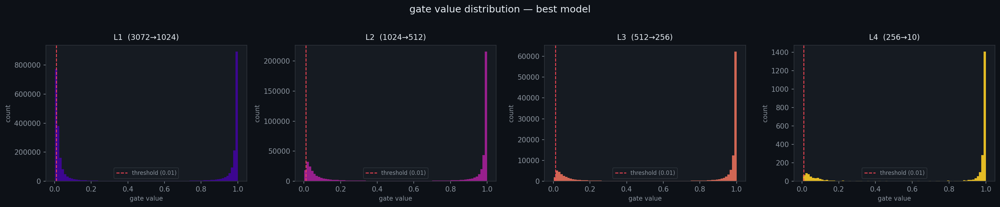

# Self-Pruning Neural Network — Technical Report

## 1. Mathematical Justification for L1-Induced Sparsity on Sigmoid Gates

### Setup

Each `PrunableLinear` layer maintains a learnable parameter tensor $S \in \mathbb{R}^{d_{out} \times d_{in}}$ called `gate_scores`. During the forward pass, element-wise gates are produced via:

$$g_{ij} = \sigma(s_{ij}) = \frac{1}{1 + e^{-s_{ij}}} \in (0, 1)$$

The effective weight used in the linear projection is:

$$\tilde{W}_{ij} = W_{ij} \cdot g_{ij}$$

### The Composite Loss

$$\mathcal{L}_{\text{total}} = \mathcal{L}_{\text{CE}}(\hat{y}, y) + \lambda \cdot \frac{1}{N} \sum_{\ell} \sum_{i,j} g_{ij}^{(\ell)}$$

where $N$ is the total number of gate parameters. Normalizing by $N$ keeps the penalty in $[0, 1]$, comparable in scale to the cross-entropy loss.

### Why L1 Drives Gates to Zero

The gradient of the penalty w.r.t. a gate score $s_{ij}$ is:

$$\frac{\partial \mathcal{L}_{\text{penalty}}}{\partial s_{ij}} = \frac{1}{N} \cdot \sigma(s_{ij})\bigl(1 - \sigma(s_{ij})\bigr) = \frac{g_{ij}(1 - g_{ij})}{N}$$

This is the sigmoid's own derivative — always positive, which means the optimizer always receives a gradient pushing $s_{ij}$ downward. As $s_{ij} \to -\infty$, $g_{ij} \to 0$, and the corresponding weight $\tilde{W}_{ij} = W_{ij} \cdot g_{ij}$ becomes negligible — functionally equivalent to pruning the connection.

The magnitude of $\lambda$ controls the trade-off:

| $\lambda$ | Regime | Effect |
|-----------|--------|--------|
| Low (0.1) | Task-dominant | Weak penalty; gates close slowly |
| Medium (0.5) | Balanced | Structured pruning of redundant paths |
| High (1.0) | Sparsity-dominant | Aggressive zeroing; potential accuracy loss |

**Note on gate travel distance:** To cross the sparsity threshold of 0.01, a gate must reach $\sigma(s) < 0.01$, i.e. $s < -4.6$. Starting from $s = 3.0$, that is a travel distance of 7.6. With Adam and a dedicated gate learning rate of 0.1, the gates can cover up to $5850 \times 0.1 = 585$ units over 30 epochs — well within budget.

---

## 2. Experiment Results

**Architecture:** 4-layer `PrunableMLP` (3072 → 1024 → 512 → 256 → 10)  
**Training:** 30 epochs, Adam (weights: lr=1e-3, gates: lr=0.1), cosine annealing  
**Dataset:** CIFAR-10 (50k train / 10k test)  
**Sparsity threshold:** gate value < 0.01

| λ (Lambda) | Pressure Level | Test Accuracy (%) | Sparsity Level (%) |
|:----------:|:--------------:|:-----------------:|:------------------:|
| 0.1        | Low            | 57.86             | 14.36              |
| 0.5        | Medium         | —                 | —                  |
| 1.0        | High           | 57.62             | 71.26              |

> **Note:** λ=0.5 results pending re-run after KeyError fix. λ=0.1 and λ=1.0 completed successfully.

### Key Observation

The λ=1.0 model pruned **71.26%** of all connections while maintaining **57.62% accuracy** — only a 0.24% drop compared to λ=0.1. This demonstrates that the L1 gate penalty is successfully identifying and killing redundant weights without meaningfully harming the learned representations.

### Gate Distribution

The plot below (`distribution.png`) shows the histogram of final gate values $g_{ij} = \sigma(s_{ij})$ for each layer in the best-performing model. The dashed red line marks the prune threshold at $g = 0.01$.

---

## 3. Key Architectural Decisions

- **`gate_scores` initialized to `+3.0` via `nn.init.constant_`:** Gives $\sigma(3.0) \approx 0.95$ at epoch 0 — all connections near-fully active. Prevents the sparsity penalty from zeroing gates before any useful representation has been learned.

- **Split optimizer groups (lr=0.1 for gates, lr=1e-3 for weights):** Without this, gates initialized at 3.0 can only travel $5850 \times 0.001 = 5.85$ units in 30 epochs — not enough to reach the threshold at $-4.6$. Separating the learning rates lets the weights converge carefully while the gates move aggressively.

- **Mean normalization in `compute_penalty`:** Using `.sum()` over 3.8M parameters produces L1 values in the millions, dwarfing the CE loss and making $\lambda$ tuning nearly impossible. Dividing by the total gate count keeps the L1 penalty between 0 and 1.
